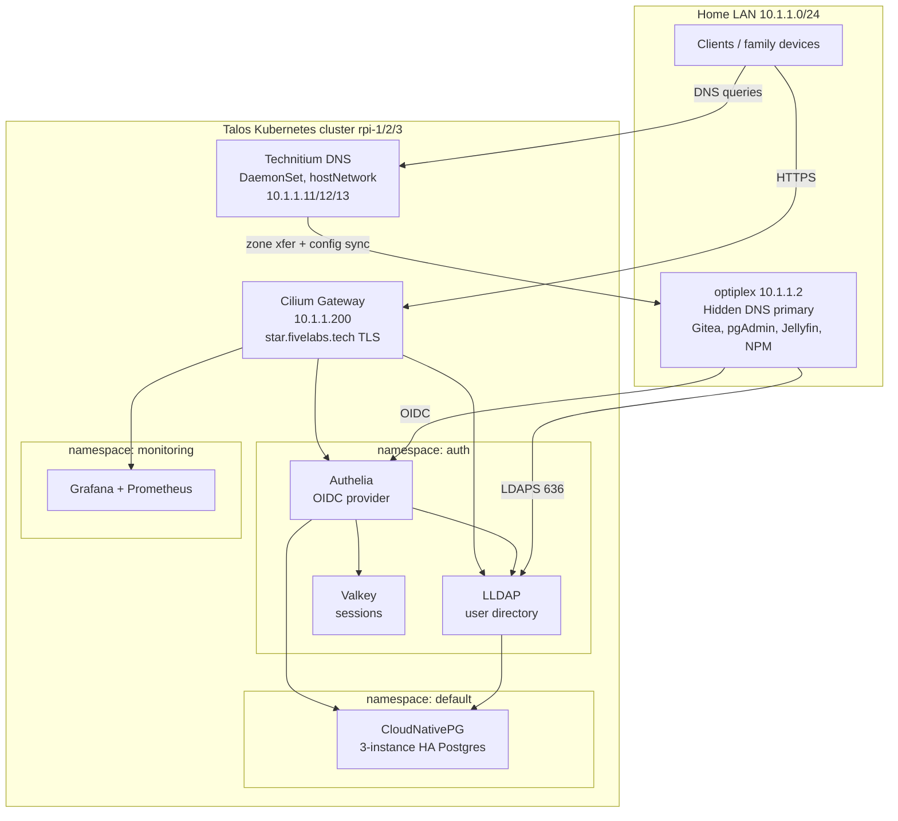
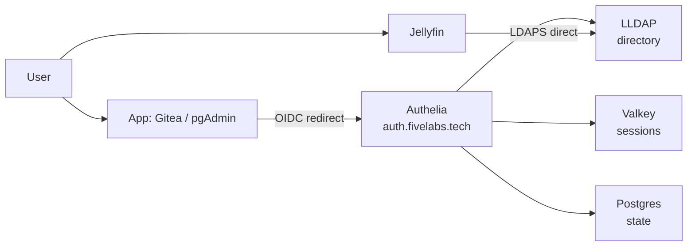

# Homelab: 3-Node Talos Kubernetes Cluster

A self-hosted, high-availability homelab built on a 3-node Raspberry Pi 4 cluster running
[Talos Linux](https://www.talos.dev/) and Kubernetes. It provides HA Postgres, redundant DNS,
automated trusted TLS, and a full self-hosted single-sign-on (SSO) identity stack that real
services authenticate against.

> **Status:** working and stress-tested (node loss, database primary failover, and LoadBalancer
> failover all validated). Built incrementally as a learning project.

---

## Contents

- [Homelab: 3-Node Talos Kubernetes Cluster](#homelab-3-node-talos-kubernetes-cluster)
  - [Contents](#contents)
  - [Architecture at a glance](#architecture-at-a-glance)
  - [Hardware \& platform](#hardware--platform)
  - [Networking](#networking)
    - [Reserved LoadBalancer IPs](#reserved-loadbalancer-ips)
    - [Gateway listeners](#gateway-listeners)
  - [Storage](#storage)
  - [TLS / certificates](#tls--certificates)
  - [Stateful services](#stateful-services)
    - [PostgreSQL — CloudNativePG](#postgresql--cloudnativepg)
    - [DNS — Technitium (hidden-primary cluster)](#dns--technitium-hidden-primary-cluster)
  - [Identity \& SSO](#identity--sso)
    - [Service integrations](#service-integrations)
  - [Observability](#observability)
  - [Naming \& domain conventions](#naming--domain-conventions)
  - [Namespaces](#namespaces)
  - [Secrets \& things you must not lose](#secrets--things-you-must-not-lose)
  - [Operational gotchas (hard-won lessons)](#operational-gotchas-hard-won-lessons)
  - [Repository layout (manifests)](#repository-layout-manifests)

---

## Architecture at a glance



**Request & auth flows in words:**

- Family devices get DNS from the three in-cluster Technitium secondaries (`10.1.1.11/12/13`).
- Web apps are reached at `https://<app>.fivelabs.tech`, terminated with a trusted Let's Encrypt
  cert at the Cilium Gateway (`10.1.1.200`).
- **OIDC apps** (Gitea, pgAdmin) redirect to Authelia (`auth.fivelabs.tech`), which authenticates
  the user against LLDAP, stores sessions in Valkey and state in Postgres.
- **Jellyfin** authenticates **directly against LLDAP over LDAPS** (no Authelia in the path) so
  native TV/phone clients keep working.

---

## Hardware & platform

| Layer | Choice | Notes |
|---|---|---|
| Nodes | 3× Raspberry Pi 4 (8GB) | `rpi-1/2/3` = `10.1.1.11/12/13` |
| Disks | Samsung 870 EVO SSD via USB3 UASP adapter | Replaced flash drives that couldn't sustain etcd fsync |
| OS | Talos Linux (immutable, API-managed) | Install disk `/dev/sda` |
| Kubernetes | v1.36.2 | Bootstrapped by Talos |
| Roles | All 3 nodes control-plane **and** worker | `allowSchedulingOnControlPlanes: true` |
| API endpoint | `https://10.1.1.10:6443` | Talos-managed VIP |

The control plane tolerates one node failure (etcd quorum of 3). Node reboots rejoin etcd
automatically (learner → full member).

---

## Networking

Everything is handled by **Cilium** — no MetalLB, no Flannel, no kube-proxy.

- **CNI + kube-proxy replacement** (via KubePrism at `localhost:7445`).
- **LoadBalancer IPAM** — pool `10.1.1.200–250`, assigned via `CiliumLoadBalancerIPPool`.
- **L2 announcement** — lease-based, on interface `end0`; proven failover with zero dropped requests.
- **Gateway API** — a single `Gateway` ("main-gateway") pinned to `10.1.1.200`.

### Reserved LoadBalancer IPs

| IP | Service |
|---|---|
| `10.1.1.200` | Cilium Gateway (all `*.fivelabs.tech` web traffic) |
| `10.1.1.201` | LLDAP LDAPS (`ldap.fivelabs.tech`, 636 → 6360) |
| `10.1.1.202` | Postgres primary (`db.fivelabs.tech`, follows failover) |

### Gateway listeners

- **HTTP (80)** — a catch-all `HTTPRoute` that 301-redirects all `*.fivelabs.tech` to HTTPS.
- **HTTPS (443, `https-fivelabs`)** — hostname `*.fivelabs.tech`, TLS terminated with the
  wildcard cert. Apps attach with an `HTTPRoute` bound to `sectionName: https-fivelabs`.

> **Adding a new web service:** create an `HTTPRoute` bound to `https-fivelabs`. It automatically
> gets the wildcard cert **and** the HTTP→HTTPS redirect — no new DNS record or cert needed.

---

## Storage

- **local-path-provisioner** is the default `StorageClass` — node-local storage on each SSD.
- Path is `/var/local-path-provisioner` (**not** `/var/mnt`, which Talos mounts read-only).
- `WaitForFirstConsumer` — a PVC stays `Pending` until a pod mounts it (this is normal).
- Node-pinned: a volume lives on one node's disk; if that node is down, the pod waits for it.

---

## TLS / certificates

- **cert-manager** with a **Let's Encrypt** `ClusterIssuer` using a **Cloudflare DNS-01** solver.
- Issues a trusted **wildcard** cert for `fivelabs.tech` + `*.fivelabs.tech` (auto-renewing).
- The cert is issued into every namespace that needs it (e.g. `default` for the Gateway, `auth`
  for LLDAP's LDAPS) via per-namespace `Certificate` resources.

> **Split-horizon note (important):** because internal Technitium is authoritative for
> `fivelabs.tech`, cert-manager's DNS-01 self-check is forced onto public resolvers so it can see
> the ACME TXT record at Cloudflare:
>
> ```
> --dns01-recursive-nameservers-only
> --dns01-recursive-nameservers=1.1.1.1:53,8.8.8.8:53
> ```
>
> Set via `helm upgrade cert-manager ... --set "extraArgs={...}"`. Without this, issuance hangs on
> "record not yet propagated" even though the record is live publicly.

Infrastructure names under `*.lan` / `*.k8s.lan` are fake TLDs and **cannot** get Let's Encrypt
certs — they would need a local CA issuer (deferred).

---

## Stateful services

### PostgreSQL — CloudNativePG

- A 3-instance HA `Cluster` ("pg"), one instance per node (anti-affinity), streaming replication.
- **Automatic failover** (~2s) — the `pg-rw` service always points at the current primary.
- In-cluster: `pg-rw.default.svc.cluster.local:5432` (`sslmode=require`).
- External: `10.1.1.202` / `db.fivelabs.tech` via a LoadBalancer that follows the primary.
- **Per-app databases** are created declaratively with the `Database` CRD; **per-app roles** with
  `managed.roles` in the Cluster spec.
- Break-glass superuser is enabled for admin/emergency use only.

### DNS — Technitium (hidden-primary cluster)

- **Primary** (source of truth) runs *outside* the cluster on `optiplex` (10.1.1.2). It is
  **hidden** — never handed to clients.
- **Secondaries** run in-cluster as a **DaemonSet** with `hostNetwork`, bound to the node static
  IPs `10.1.1.11/12/13`. These are the resolvers clients actually use (via DHCP).
- A **configurator sidecar** applies per-node settings (DNS listener bound to the node IP, HTTPS
  on 53443) via the Technitium HTTP API on boot, so the DaemonSet is reproducible.
- Zones replicate primary → secondaries; config syncs via Technitium clustering.

---

## Identity & SSO

All in namespace `auth`.



| Component | Role |
|---|---|
| **LLDAP** | User directory (LDAP). Postgres-backed; stateless via a stable `KEY_SEED`. Web UI at `lldap.fivelabs.tech`; LDAPS on the LAN at `ldap.fivelabs.tech:636`. |
| **Authelia** | OIDC identity provider. Authenticates against LLDAP; state in Postgres, sessions in Valkey. Portal at `auth.fivelabs.tech`. |
| **Valkey** | Redis-compatible session store for Authelia (ephemeral, single replica). |

### Service integrations

| Service | Location | Method | Notes |
|---|---|---|---|
| Gitea | optiplex | **OIDC** via Authelia | Native OIDC support |
| pgAdmin | optiplex | **OIDC** via Authelia | Configured in `config_local.py` |
| Grafana | cluster | (planned OIDC) | Currently local login |
| Jellyfin | optiplex | **LDAP direct** (LDAPS) | Authelia deliberately *not* in front — preserves native app clients |
| NPM | optiplex | none | Legacy reverse proxy, being phased out |

**Design principle:** OIDC where the app supports it; LDAP-direct for Jellyfin so streaming
clients keep working. Local break-glass accounts are always retained (e.g. Jellyfin `admin`/`tv`,
pgAdmin `internal` during rollout).

---

## Observability

- **kube-prometheus-stack** (Helm) in namespace `monitoring`: Prometheus, Grafana, Alertmanager,
  kube-state-metrics, and node-exporter.
- The `monitoring` namespace must enforce PodSecurity **`privileged`** — node-exporter legitimately
  requires `hostNetwork`, `hostPID`, `hostPath`, and a `hostPort`.
- Grafana is exposed at `grafana.fivelabs.tech` via the Gateway (TLS, wildcard cert, no new DNS).

---

## Naming & domain conventions

| Pattern | Meaning | TLS |
|---|---|---|
| `*.fivelabs.tech` | Family-facing / "complete" services. Real registered domain, used **only internally**. | Let's Encrypt (trusted) |
| `*.lan`, `*.k8s.lan` | Infrastructure. Fake TLDs. | Would need a local CA (deferred) |

DNS specifics:
- `*.fivelabs.tech` wildcard → `10.1.1.200` (the Gateway).
- Specific records **override** the wildcard — e.g. `db.fivelabs.tech` → `10.1.1.202`,
  `ldap.fivelabs.tech` → `10.1.1.201`. When migrating a service off optiplex, delete its specific
  `10.1.1.2` record so the wildcard takes over.

---

## Namespaces

| Namespace | Contents | PodSecurity |
|---|---|---|
| `default` | Cilium Gateway, CNPG Postgres cluster + LB, wildcard Certificate | (warns at restricted) |
| `auth` | LLDAP, Authelia, Valkey | baseline |
| `monitoring` | kube-prometheus-stack | **privileged** |
| `technitium` | DNS DaemonSet | **privileged** (hostNetwork) |
| `cnpg-system` | CloudNativePG operator | — |
| `cert-manager` | cert-manager | — |
| `local-path-storage` | storage provisioner | privileged |

---

## Secrets & things you must not lose

**Kept out of git** (documented as required, created out-of-band):

- CNPG app/role secrets (`lldap-db-app`, `authelia-db-app`, `pg-app`)
- `lldap-secrets`, `authelia-secrets`, `valkey-auth`
- Cloudflare API token (`cloudflare-api-token`, namespace `cert-manager`)
- Technitium admin password
- Plaintext OIDC client secrets (live on the app side: Gitea auth source, pgAdmin `config_local.py`)
- `talosconfig`, `kubeconfig`, per-node Talos machine configs

**Permanent — losing these is unrecoverable:**

| Secret | Consequence if lost/changed |
|---|---|
| LLDAP `KEY_SEED` | Invalidates **all** stored user passwords |
| Authelia `storage-encryption-key` | Makes stored TOTP secrets & OIDC tokens unrecoverable |

Back these up somewhere durable and offline.

---

## Operational gotchas (hard-won lessons)

- **Talos `/var/mnt` is read-only** (reserved for user volumes). Use `/var/local-path-provisioner`
  for the storage provisioner path.
- **Talos runs host DNS on `127.0.0.53:53`.** A `hostNetwork` DNS server (Technitium) must bind the
  **specific node IP**, not `0.0.0.0`, or the `:53` bind fails.
- **cert-manager split-horizon:** point the DNS-01 self-check at public resolvers (see
  [TLS](#tls--certificates)).
- **Cilium + cert-manager Gateway TLS:** create the `Certificate` (and its `kubernetes.io/tls`
  Secret) **before** the Gateway listener references it — otherwise Cilium pre-creates an `Opaque`
  placeholder secret that blocks cert-manager.
- **Technitium zone transfer + NAT:** if the primary runs on a NAT'd container network (e.g. a
  podman bridge with published ports), inbound source IPs are masqueraded to the bridge gateway, so
  **IP-based zone-transfer ACLs won't match** the real secondary IPs. Use host networking, or allow
  the transfer explicitly.
- **LLDAP entrypoint runs `chown` unconditionally.** Under a locked-down `securityContext` it needs
  either to start as root (with `CHOWN`/`SETUID`/`SETGID`/`DAC_OVERRIDE` capabilities) or a fully
  non-root image variant.
- **Authelia is strict about config** — a single bad key stops it booting (which takes down auth for
  everything behind it). Notable: set `enableServiceLinks: false` (k8s injects `AUTHELIA_*` service
  env vars it misreads); OIDC requires ≥1 client and a `jwks` key; the issuer key is injected via
  the config **template filter** (`X_AUTHELIA_CONFIG_FILTERS=template`), not an env var.
- **kube-prometheus-stack node-exporter** needs the namespace at PodSecurity `privileged`; after
  relabeling, roll the DaemonSet so it retries admission.
- **`kubectl apply` says "unchanged"** when the file on disk wasn't actually rewritten — delete +
  recreate to force a clean roll when in doubt.
- **`kubectl logs deploy/x`** grabs only one pod; use `-l <selector> --prefix` to see all replicas
  during a rollout.

---

## Repository layout (manifests)

Representative — adjust to your tree.

```
hosts/talos/
├── common.yaml                 # shared Talos patch (install disk, VIP, Cilium-ready)
├── controlplane-rpi-{1,2,3}.yaml  # per-node configs (GITIGNORED — embed secrets)
├── cilium-lb.yaml              # LoadBalancer IP pool + L2 announcement policy
├── gateway.yaml                # Gateway + HTTP/HTTPS listeners
├── fivelabs-redirect.yaml      # catch-all HTTP→HTTPS redirect
├── local-path/                 # local-path-provisioner (kustomize)
├── letsencrypt-issuers.yaml    # ACME ClusterIssuers (Cloudflare DNS-01)
├── fivelabs-cert.yaml          # wildcard Certificate (default ns)
├── fivelabs-cert-auth.yaml     # wildcard Certificate (auth ns, for LDAPS)
├── pg-cluster.yaml             # CNPG Cluster + managed.roles
├── pg-lb.yaml                  # Postgres primary LoadBalancer (.202)
├── technitium.yaml             # DNS DaemonSet + configurator sidecar
├── lldap.yaml                  # LLDAP + Service + LDAPS LoadBalancer + HTTPRoute
├── lldap-database.yaml         # CNPG Database CRD
├── valkey.yaml                 # Valkey session store
├── authelia-config.yaml        # Authelia ConfigMap (committable — no private keys)
├── authelia.yaml               # Authelia Deployment + Service + HTTPRoute
├── authelia-database.yaml      # CNPG Database CRD
└── grafana-route.yaml          # Grafana HTTPRoute
```

---

*Built and documented as a learning project. Secrets and node configs are intentionally excluded
from version control.*
