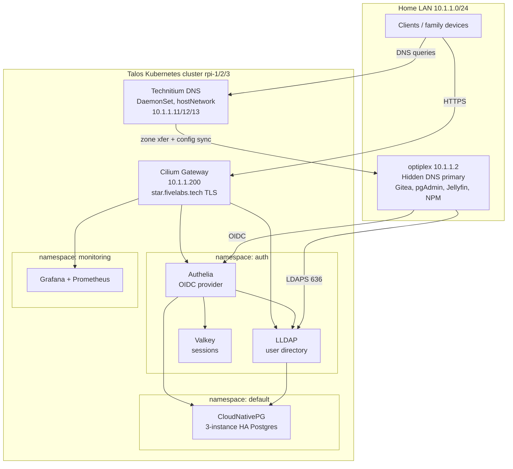
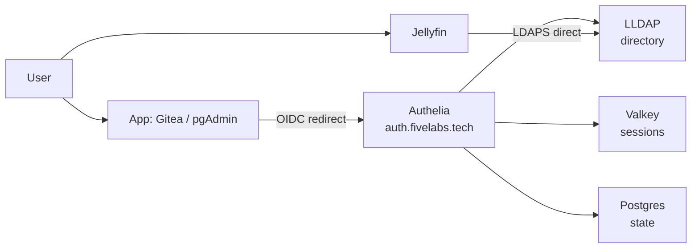

# Homelab: 3-Node Talos Kubernetes Cluster

A self-hosted, high-availability homelab built on a 3-node Raspberry Pi 4 cluster running
[Talos Linux](https://www.talos.dev/) and Kubernetes. It provides HA Postgres (with off-cluster
point-in-time backups), redundant DNS, automated trusted TLS, a full self-hosted single-sign-on
(SSO) identity stack that real services authenticate against, and a unified observability stack
(metrics + logs) in Grafana.

> **Status:** working and stress-tested (node loss, database primary failover, and LoadBalancer
> failover all validated). Built incrementally as a learning project.

---

## Contents

- [Homelab: 3-Node Talos Kubernetes Cluster](#homelab-3-node-talos-kubernetes-cluster)
  - [Contents](#contents)
  - [Architecture at a glance](#architecture-at-a-glance)
  - [Hardware \& platform](#hardware--platform)
  - [Networking](#networking)
    - [Reserved LoadBalancer IPs](#reserved-loadbalancer-ips)
    - [Gateway listeners](#gateway-listeners)
  - [Storage](#storage)
  - [TLS / certificates](#tls--certificates)
  - [Stateful services](#stateful-services)
    - [PostgreSQL — CloudNativePG](#postgresql--cloudnativepg)
    - [DNS — Technitium (hidden-primary cluster)](#dns--technitium-hidden-primary-cluster)
  - [Identity \& SSO](#identity--sso)
    - [Service integrations](#service-integrations)
  - [Observability (metrics \& logs)](#observability-metrics--logs)
    - [Metrics](#metrics)
    - [Logging (Loki)](#logging-loki)
  - [Backups \& disaster recovery](#backups--disaster-recovery)
  - [Naming \& domain conventions](#naming--domain-conventions)
  - [Namespaces](#namespaces)
  - [Secrets \& things you must not lose](#secrets--things-you-must-not-lose)
  - [Operational gotchas (hard-won lessons)](#operational-gotchas-hard-won-lessons)
  - [Updating components](#updating-components)
  - [Deferred / future work](#deferred--future-work)
  - [Repository layout (manifests)](#repository-layout-manifests)

---

## Architecture at a glance



**Request & auth flows in words:**

- Family devices get DNS from the three in-cluster Technitium secondaries (`10.1.1.11/12/13`).
- Web apps are reached at `https://<app>.fivelabs.tech`, terminated with a trusted Let's Encrypt
  cert at the Cilium Gateway (`10.1.1.200`).
- **OIDC apps** (Gitea, pgAdmin) redirect to Authelia (`auth.fivelabs.tech`), which authenticates
  the user against LLDAP, stores sessions in Valkey and state in Postgres.
- **Jellyfin** authenticates **directly against LLDAP over LDAPS** (no Authelia in the path) so
  native TV/phone clients keep working.

---

## Hardware & platform

| Layer | Choice | Notes |
|---|---|---|
| Nodes | 3× Raspberry Pi 4 (8GB) | `rpi-1/2/3` = `10.1.1.11/12/13` |
| Disks | Samsung 870 EVO SSD via USB3 UASP adapter | Replaced flash drives that couldn't sustain etcd fsync |
| OS | Talos Linux (immutable, API-managed) | Install disk `/dev/sda` |
| Kubernetes | v1.36.2 | Bootstrapped by Talos |
| Roles | All 3 nodes control-plane **and** worker | `allowSchedulingOnControlPlanes: true` |
| API endpoint | `https://10.1.1.10:6443` | Talos-managed VIP |

The control plane tolerates one node failure (etcd quorum of 3). Node reboots rejoin etcd
automatically (learner → full member).

---

## Networking

Everything is handled by **Cilium** — no MetalLB, no Flannel, no kube-proxy.

- **CNI + kube-proxy replacement** (via KubePrism at `localhost:7445`).
- **LoadBalancer IPAM** — pool `10.1.1.200–250`, assigned via `CiliumLoadBalancerIPPool`.
- **L2 announcement** — lease-based, on interface `end0`; proven failover with zero dropped requests.
- **Gateway API** — a single `Gateway` ("main-gateway") pinned to `10.1.1.200`.

### Reserved LoadBalancer IPs

| IP | Service |
|---|---|
| `10.1.1.200` | Cilium Gateway (all `*.fivelabs.tech` web traffic) |
| `10.1.1.201` | LLDAP LDAPS (`ldap.fivelabs.tech`, 636 → 6360) |
| `10.1.1.202` | Postgres primary (`db.fivelabs.tech`, follows failover) |

### Gateway listeners

- **HTTP (80)** — a catch-all `HTTPRoute` that 301-redirects all `*.fivelabs.tech` to HTTPS.
- **HTTPS (443, `https-fivelabs`)** — hostname `*.fivelabs.tech`, TLS terminated with the
  wildcard cert. Apps attach with an `HTTPRoute` bound to `sectionName: https-fivelabs`.

> **Adding a new web service:** create an `HTTPRoute` bound to `https-fivelabs`. It automatically
> gets the wildcard cert **and** the HTTP→HTTPS redirect — no new DNS record or cert needed.

---

## Storage

- **local-path-provisioner** is the default `StorageClass` — node-local storage on each SSD.
- Path is `/var/local-path-provisioner` (**not** `/var/mnt`, which Talos mounts read-only).
- `WaitForFirstConsumer` — a PVC stays `Pending` until a pod mounts it (this is normal).
- Node-pinned: a volume lives on one node's disk; if that node is down, the pod waits for it.
- **PVC size is effectively immutable** — local-path does **not** support volume expansion. You
  cannot grow a PVC in place; changing storage size requires recreating the workload (see
  [Updating components](#updating-components)). If you expect to resize storage, use a provisioner
  that supports expansion (e.g. Longhorn) instead.

---

## TLS / certificates

- **cert-manager** with a **Let's Encrypt** `ClusterIssuer` using a **Cloudflare DNS-01** solver.
- Issues a trusted **wildcard** cert for `fivelabs.tech` + `*.fivelabs.tech` (auto-renewing).
- The cert is issued into every namespace that needs it (e.g. `default` for the Gateway, `auth`
  for LLDAP's LDAPS) via per-namespace `Certificate` resources.

> **Split-horizon note (important):** because internal Technitium is authoritative for
> `fivelabs.tech`, cert-manager's DNS-01 self-check is forced onto public resolvers so it can see
> the ACME TXT record at Cloudflare:
>
> ```
> --dns01-recursive-nameservers-only
> --dns01-recursive-nameservers=1.1.1.1:53,8.8.8.8:53
> ```
>
> Set via `helm upgrade cert-manager ... --set "extraArgs={...}"`. Without this, issuance hangs on
> "record not yet propagated" even though the record is live publicly.

Infrastructure names under `*.lan` / `*.k8s.lan` are fake TLDs and **cannot** get Let's Encrypt
certs — they would need a local CA issuer (deferred).

---

## Stateful services

### PostgreSQL — CloudNativePG

- A 3-instance HA `Cluster` ("pg"), one instance per node (anti-affinity), streaming replication.
- **Automatic failover** (~2s) — the `pg-rw` service always points at the current primary.
- In-cluster: `pg-rw.default.svc.cluster.local:5432` (`sslmode=require`).
- External: `10.1.1.202` / `db.fivelabs.tech` via a LoadBalancer that follows the primary.
- **Per-app databases** are created declaratively with the `Database` CRD; **per-app roles** with
  `managed.roles` in the Cluster spec.
- Break-glass superuser is enabled for admin/emergency use only.

### DNS — Technitium (hidden-primary cluster)

- **Primary** (source of truth) runs *outside* the cluster on `optiplex` (10.1.1.2). It is
  **hidden** — never handed to clients.
- **Secondaries** run in-cluster as a **DaemonSet** with `hostNetwork`, bound to the node static
  IPs `10.1.1.11/12/13`. These are the resolvers clients actually use (via DHCP).
- A **configurator sidecar** applies per-node settings (DNS listener bound to the node IP, HTTPS
  on 53443) via the Technitium HTTP API on boot, so the DaemonSet is reproducible.
- Zones replicate primary → secondaries; config syncs via Technitium clustering.

---

## Identity & SSO

All in namespace `auth`.



| Component | Role |
|---|---|
| **LLDAP** | User directory (LDAP). Postgres-backed; stateless via a stable `KEY_SEED`. Web UI at `lldap.fivelabs.tech`; LDAPS on the LAN at `ldap.fivelabs.tech:636`. |
| **Authelia** | OIDC identity provider. Authenticates against LLDAP; state in Postgres, sessions in Valkey. Portal at `auth.fivelabs.tech`. |
| **Valkey** | Redis-compatible session store for Authelia (ephemeral, single replica). |

### Service integrations

| Service | Location | Method | Notes |
|---|---|---|---|
| Gitea | optiplex | **OIDC** via Authelia | Native OIDC support |
| pgAdmin | optiplex | **OIDC** via Authelia | Configured in `config_local.py` |
| Grafana | cluster | **OIDC** via Authelia | Local login form disabled; `admin` LLDAP group → Grafana Admin (via `role_attribute_path`), else Viewer |
| Nextcloud | optiplex | **OIDC** via Authelia (`user_oidc`) | `family` group required (enforced in Authelia `access_control`); `admin` group → Nextcloud admin; local form hidden, break-glass at `/login?direct=1` |
| OnlyOffice | optiplex | **none** (rides Nextcloud) | Document Server trusts Nextcloud via shared JWT; not an Authelia client |
| Jellyfin | optiplex | **LDAP direct** (LDAPS) | Authelia deliberately *not* in front — preserves native app clients |
| NPM | optiplex | none | Legacy reverse proxy, being phased out |

**Design principle:** OIDC where the app supports it; LDAP-direct for Jellyfin so streaming
clients keep working; OnlyOffice rides Nextcloud's session (never put an auth proxy in front of it).
Local break-glass accounts are always retained (e.g. Jellyfin `admin`/`tv`, Nextcloud local `admin`
via `/login?direct=1`).

---

## Observability (metrics & logs)

### Metrics

- **kube-prometheus-stack** (Helm) in namespace `monitoring`: Prometheus, Grafana, Alertmanager,
  kube-state-metrics, and node-exporter.
- The `monitoring` namespace must enforce PodSecurity **`privileged`** — node-exporter legitimately
  requires `hostNetwork`, `hostPID`, `hostPath`, and a `hostPort`.
- Grafana is exposed at `grafana.fivelabs.tech` via the Gateway (TLS, wildcard cert, no new DNS).
- Grafana auth is **OIDC via Authelia** (`[auth.generic_oauth]` set through the chart's
  `grafana.ini` values; client secret injected from the `grafana-oidc` Secret via `$__env{}`). The
  local login form is disabled (`[auth] disable_login_form = true`) — break-glass is reverting that
  value and re-running `helm upgrade`. `role_attribute_path` maps the `admin` LLDAP group to Grafana
  **Admin**, everyone else to **Viewer**. Server-side token/userinfo calls use the public
  `auth.fivelabs.tech` URLs (the Grafana pod reaches them fine via the Gateway).

### Logging (Loki)

Log aggregation via **Grafana Loki**, queried in the same Grafana as metrics.

| Piece | Detail |
|---|---|
| Store/query engine | **Loki** (Helm, `grafana-community/loki`), **Monolithic** mode, single replica, namespace `loki` |
| Chunk storage | **MinIO** on optiplex (bucket `loki-logs`), same S3 backend pattern as Postgres backups |
| Collection (cluster) | **Grafana Alloy** DaemonSet (namespace `alloy`, PodSecurity `privileged`) — scrapes every pod's stdout, labels with `namespace`/`pod`/`container`/`app`, ships to Loki. (Promtail is EOL; Alloy replaces it.) |
| Collection (external app) | The ASP.NET app on optiplex pushes directly via the **`Serilog.Sinks.Grafana.Loki`** sink (JSON format) — it's outside the cluster, so Alloy doesn't cover it |
| App push endpoint | `https://loki.fivelabs.tech` (HTTPRoute on the Gateway, TLS via wildcard cert) — the sink appends `/loki/api/v1/push` automatically |
| Retention | 7 days (`retention_period: 168h` + compactor `retention_enabled`) |
| Grafana datasource | Loki at `http://loki.loki.svc.cluster.local:3100` |

**Label discipline (the core Loki concept):** labels are the index — keep them **few and
low-cardinality** (`app`, `environment`, `namespace`). Everything else (versions, request IDs, the
message, enriched properties) rides as log **content**, queried with a parser (`| json` or
`| logfmt`), *not* promoted to labels. The Serilog sink is configured with
`propertiesAsLabels: []` precisely to keep enriched properties as content.

**Querying:** Go services (Loki, Authelia, cert-manager, CNPG) log **logfmt** → parse with
`| logfmt`. The ASP.NET app logs **JSON** → parse with `| json`. Filter on the real level field
(e.g. `| json | level=~"(?i)error|warn"`), not a substring `|= "error"` (which false-matches any
line mentioning the word). Cluster logs and the app share one Loki; the app is queried by
`{app="engagency"}` and also carries `namespace="engagency"` so it appears in the cluster dashboard's
namespace dropdown.

**Dashboards:** a "Cluster Logs Overview" (log volume, by-namespace, errors-by-namespace, recent
error lines, with a `namespace` template variable) and a separate app-specific dashboard for the
ASP.NET service.

> Seq was retired in favour of Loki (licensing/open-source motivation); the Seq quadlet on optiplex
> was decommissioned after a parallel bake period confirmed Loki captured everything.

---

## Backups & disaster recovery

PostgreSQL is backed up to **MinIO** (S3-compatible object storage) running as a podman quadlet
on **optiplex** (`10.1.1.2`) — deliberately *outside* the cluster, so backups survive the whole
cluster failing. Backups use CNPG's **Barman Cloud Plugin** (the in-tree `barmanObjectStore` is
removed as of CNPG 1.30).

**What's protected & how:**

| Piece | Detail |
|---|---|
| Object store | MinIO on optiplex, bucket `s3://cnpg-backups/`, endpoint `http://10.1.1.2:9000` |
| Base backups | Nightly `ScheduledBackup` at `0 0 8 * * *` (08:00 UTC = 3 AM EST / 4 AM EDT) |
| WAL archiving | Continuous (plugin `isWALArchiver: true`) — enables **point-in-time recovery** |
| Compression | gzip on both base and WAL |
| Retention | 30 days (older backups pruned automatically) |
| Credentials | MinIO service-account key in Secret `minio-backup-creds` (namespace `default`, keys `ACCESS_KEY_ID` / `ACCESS_SECRET_KEY`) — **not** the MinIO root password |

**Components:**

- `ObjectStore` (`minio-store`) — connects CNPG to MinIO (`barmancloud.cnpg.io/v1`).
- `Cluster` `plugins:` block — enables the plugin + WAL archiving on the `pg` cluster.
- `ScheduledBackup` (`pg-nightly`) — the nightly base backup.
- The **Barman Cloud Plugin** itself is installed in `cnpg-system` (depends on cert-manager, which
  is already present).

**Verifying backups land:**

```bash
kubectl -n default get backup                      # recent backups should show "completed"
# from optiplex, list the bucket contents:
mc ls -r localminio/cnpg-backups                    # base/ dirs + wals/ segments
```

**Restore (disaster recovery):** CNPG restores by bootstrapping a *new* cluster from the
`minio-store` ObjectStore via a `bootstrap.recovery` stanza (optionally to a specific point in time
via `recoveryTarget.targetTime`, using the archived WAL). The recovery cluster must be **read-only**
against the store — reference the source `serverName: pg` in an `externalClusters` entry and **omit**
the top-level `plugins:` WAL-archiver block, so the test cluster can't overwrite the real backups
(CNPG's "WAL archive check" safety net guards against this too).

> **Restore verified:** last successfully test-restored **2026-09-01** — bootstrapped a throwaway
> single-instance cluster from MinIO, confirmed all databases (`app`, `authelia`, `lldap`,
> `engagency*`) and row-level data recovered, then tore it down. Re-test periodically (a backup
> system that silently breaks is a classic failure mode).

> **MinIO console caveat:** recent MinIO community builds ship a browser-only console (no
> user/key/policy management in the UI). Create access keys and policies with the `mc` CLI
> (`mc admin user svcacct add ...`), not the web console.

> **Known limitation — backup traffic is plaintext HTTP (accepted for now).** CNPG reaches MinIO
> over `http://10.1.1.2:9000`, so the S3 credentials and backup data cross the LAN unencrypted.
> This is an accepted tradeoff on the trusted home LAN. To secure it, give MinIO a TLS cert and
> switch the `ObjectStore` to `https://` with the plugin's `endpointCA` field pointing at the
> issuing CA. This is folded into the **future local-CA project** (see below) — issue a MinIO server
> cert from the local root CA, serve HTTPS on optiplex, and have CNPG trust it via `endpointCA`.

---

## Naming & domain conventions

| Pattern | Meaning | TLS |
|---|---|---|
| `*.fivelabs.tech` | Family-facing / "complete" services. Real registered domain, used **only internally**. | Let's Encrypt (trusted) |
| `*.lan`, `*.k8s.lan` | Infrastructure. Fake TLDs. | Would need a local CA (deferred) |

DNS specifics:
- `*.fivelabs.tech` wildcard → `10.1.1.200` (the Gateway).
- Specific records **override** the wildcard — e.g. `db.fivelabs.tech` → `10.1.1.202`,
  `ldap.fivelabs.tech` → `10.1.1.201`. When migrating a service off optiplex, delete its specific
  `10.1.1.2` record so the wildcard takes over.

---

## Namespaces

| Namespace | Contents | PodSecurity |
|---|---|---|
| `default` | Cilium Gateway, CNPG Postgres cluster + LB, wildcard Certificate | (warns at restricted) |
| `auth` | LLDAP, Authelia, Valkey | baseline |
| `monitoring` | kube-prometheus-stack | **privileged** |
| `loki` | Loki (log store) | baseline |
| `alloy` | Grafana Alloy (log collector DaemonSet) | **privileged** (hostPath log access) |
| `technitium` | DNS DaemonSet | **privileged** (hostNetwork) |
| `cnpg-system` | CloudNativePG operator | — |
| `cert-manager` | cert-manager | — |
| `local-path-storage` | storage provisioner | privileged |

---

## Secrets & things you must not lose

**Kept out of git** (documented as required, created out-of-band):

- CNPG app/role secrets (`lldap-db-app`, `authelia-db-app`, `pg-app`)
- `lldap-secrets`, `authelia-secrets`, `valkey-auth`
- Cloudflare API token (`cloudflare-api-token`, namespace `cert-manager`)
- Technitium admin password
- Plaintext OIDC client secrets (live on the app side: Gitea auth source, pgAdmin `config_local.py`)
- `talosconfig`, `kubeconfig`, per-node Talos machine configs

**Permanent — losing these is unrecoverable:**

| Secret | Consequence if lost/changed |
|---|---|
| LLDAP `KEY_SEED` | Invalidates **all** stored user passwords |
| Authelia `storage-encryption-key` | Makes stored TOTP secrets & OIDC tokens unrecoverable |

Back these up somewhere durable and offline.

---

## Operational gotchas (hard-won lessons)

- **Talos `/var/mnt` is read-only** (reserved for user volumes). Use `/var/local-path-provisioner`
  for the storage provisioner path.
- **local-path PVCs can't be resized — growing storage wedges CNPG.** Bumping a CNPG cluster's
  `spec.storage.size` on local-path makes the operator try to resize existing PVCs; local-path
  refuses, the reconcile loop errors every cycle (and stops creating/managing instances), and the
  webhook then blocks shrinking the value back. Recovery = delete the `Cluster` + PVCs and recreate
  at the target size, restoring from a `pg_dumpall` backup. Take the backup *before* touching size.
- **Talos runs host DNS on `127.0.0.53:53`.** A `hostNetwork` DNS server (Technitium) must bind the
  **specific node IP**, not `0.0.0.0`, or the `:53` bind fails.
- **cert-manager split-horizon:** point the DNS-01 self-check at public resolvers (see
  [TLS](#tls--certificates)).
- **Cilium + cert-manager Gateway TLS:** create the `Certificate` (and its `kubernetes.io/tls`
  Secret) **before** the Gateway listener references it — otherwise Cilium pre-creates an `Opaque`
  placeholder secret that blocks cert-manager.
- **Technitium zone transfer + NAT:** if the primary runs on a NAT'd container network (e.g. a
  podman bridge with published ports), inbound source IPs are masqueraded to the bridge gateway, so
  **IP-based zone-transfer ACLs won't match** the real secondary IPs. Use host networking, or allow
  the transfer explicitly.
- **LLDAP entrypoint runs `chown` unconditionally.** Under a locked-down `securityContext` it needs
  either to start as root (with `CHOWN`/`SETUID`/`SETGID`/`DAC_OVERRIDE` capabilities) or a fully
  non-root image variant.
- **Authelia is strict about config** — a single bad key stops it booting (which takes down auth for
  everything behind it). Notable: set `enableServiceLinks: false` (k8s injects `AUTHELIA_*` service
  env vars it misreads); OIDC requires ≥1 client and a `jwks` key; the issuer key is injected via
  the config **template filter** (`X_AUTHELIA_CONFIG_FILTERS=template`), not an env var.
- **kube-prometheus-stack node-exporter** needs the namespace at PodSecurity `privileged`; after
  relabeling, roll the DaemonSet so it retries admission.
- **`169.254.169.254` in an S3 client's logs = "credentials not found."** It's the AWS EC2 metadata
  endpoint; the SDK falls back to it when it got no keys, then times out. Seen with Loki when its
  MinIO credentials weren't wired — it's a credentials problem, not a network one.
- **The Loki Helm chart's S3-credential injection via `extraEnv`/`-config.expand-env=true` is
  unreliable** (documented in upstream issues; it silently doesn't wire through for some pods/modes).
  Pragmatic fix: put the MinIO key/secret **inline** in the `s3` config and gitignore the values
  file (commit a `*.example.yaml` with placeholders). Also: the chart's default cache pods
  (`chunks-cache`/`results-cache`) request too much memory to schedule on a Pi — disable them; and
  default health-probe timeouts (`1s`) are too tight for ARM startup — loosen them.
- **Loki chart chart-key renames:** the chart moved to the `grafana-community` repo, `SingleBinary`
  became `Monolithic`, and the bundled MinIO is deprecated — use an external MinIO with
  `minio.enabled: false`.
- **`kubectl apply` says "unchanged"** when the file on disk wasn't actually rewritten — delete +
  recreate to force a clean roll when in doubt.
- **`kubectl logs deploy/x`** grabs only one pod; use `-l <selector> --prefix` to see all replicas
  during a rollout.
- **OIDC client secrets are a matched pair from one `authelia crypto hash generate` run** — the
  *plaintext* goes to the client (app), the *digest* goes to Authelia's client config. Regenerating
  means updating **both** sides; updating only one gives a generic `invalid_client` at the token
  exchange (the browser redirect still works, so it looks fine until the invisible server-side call
  fails). Also mind `token_endpoint_auth_method` matching on both ends (`client_secret_post` vs
  `client_secret_basic`).
- **`kubectl apply` reporting `unchanged` when you expected a change means your edit didn't save** —
  a surprisingly common cause of "I fixed it but nothing happened." Verify the file was written.
- **Nextcloud blocks outbound requests to private IPs by default** (SSRF protection). Reaching an
  internal service (e.g. Authelia at `10.1.1.200`) fails with "violates local access rules" until you
  set `occ config:system:set allow_local_remote_servers --value=true`. `curl` from the container
  works fine — it's a Nextcloud-specific guard, so the error only shows in Nextcloud's log.
- **Install Nextcloud apps via `occ app:install`, not the web UI** — the app-store UI can return an
  opaque `403` (session/permission quirk); the CLI just works and gives real errors.
- **`user_oidc` hashes the username by default** (`uniqueUid: true`) — you get a GUID user ID instead
  of the real name. Set `--unique-uid=0` (and `--mapping-uid=preferred_username`) for clean
  usernames. This is OIDC's opaque `sub` at work; pgAdmin shows the same GUID for the same reason.
- **Nextcloud brute-force throttling attributes attempts to the IP it *sees*** — behind a proxy that
  can be the proxy's container IP, not the real client (even with `trusted_proxies` set). Find the
  real one with `occ log:tail | grep "Remote IP"`, then `occ security:bruteforce:reset <ip>`.
  Successful logins don't clear an existing throttle window.
- **OnlyOffice rides Nextcloud's auth** — never put an auth proxy in front of the Document Server; it
  authenticates to Nextcloud via a shared JWT (`jwt_secret` must match on both sides), independent of
  how users log in.
- **Don't run OnlyOffice Document Server on `:latest` + `AutoUpdate=registry`** — a container restart
  silently upgrades it and can break the Nextcloud connector integration. Pin the version like
  everything else. (Its `/healthcheck` endpoint returning `true` confirms the server itself is fine.)
- **Client-side content blockers can break OnlyOffice** — uBlock/Ghostery false-positive-block the
  editor's `Analytics.js` (blocked by *filename*, not because it's a tracker). Symptom: editor spins
  forever; Network tab shows the asset "Stalled" and `ERR_FAILED` while `curl` gets `200`. That
  combination (**Stalled + curl works**) always means a *client-side* block, not a server problem.
  Ghostery's per-site pause doesn't override its network-layer rule; allowlist or remove it.

---

## Updating components

Nothing here auto-updates. Every workload uses a **pinned image tag** (never `:latest`), so
updates are explicit and rollbacks are trivial. The mechanism differs by how each thing was
deployed:

| Component | How it was deployed | How to update |
|---|---|---|
| CloudNativePG **operator** | Helm | `helm repo update && helm upgrade cnpg cnpg/cloudnative-pg -n cnpg-system` |
| **PostgreSQL version** (the database) | CNPG `Cluster` resource | Edit `imageName` in `pg-cluster.yaml`, apply — CNPG does a rolling update (replicas first, then a switchover) |
| cert-manager | Helm | `helm upgrade cert-manager jetstack/cert-manager -n cert-manager` (preserve custom `extraArgs` — see TLS note) |
| kube-prometheus-stack | Helm | `helm repo update && helm upgrade prometheus prometheus-community/kube-prometheus-stack -n monitoring` |
| Loki | Helm | `helm upgrade loki grafana-community/loki -n loki -f loki-values.yaml` (real values file, not the example) |
| Alloy | Helm | `helm upgrade alloy grafana/alloy -n alloy -f alloy-values.yaml` |
| Technitium, LLDAP, Authelia, Valkey | plain Deployment / DaemonSet | Edit the image tag in the manifest, `kubectl apply`, watch `kubectl rollout status` |

**Safe update pattern for stateful components:**

1. **Read the release notes** — especially for major version bumps (breaking changes, migrations).
2. **Back up first** — CNPG backup for Postgres; Settings → Backup export for Technitium.
3. **Bump the pinned tag** in the manifest (keep it explicit).
4. **Apply and watch the rollout** (`kubectl rollout status`, check logs).
5. **Verify**, and roll back if needed (`kubectl rollout undo`, re-apply the old tag, or restore a backup).
6. **Commit** the version bump so the repo matches reality.

**Notes:**

- **Postgres minor** bumps (18.1 → 18.2) are safe rolling updates. **Major** bumps (18 → 19)
  involve a real migration — read the CNPG release notes first.
- **Do NOT try to grow Postgres storage in place on local-path.** Bumping `spec.storage.size`
  makes CNPG attempt a PVC resize, which local-path rejects — this *wedges the operator's reconcile
  loop* (it errors every cycle and stops managing the cluster), and the validation webhook then
  refuses to let you shrink the value back. The only reliable way to change storage size on
  local-path is: **back up (`pg_dumpall`) → delete the `Cluster` and its PVCs → recreate at the new
  size → restore the dump.** New PVCs provision at the new size with no resize involved. (Or migrate
  to Longhorn, after which a `size:` bump works normally.)
- **Technitium is a cluster** — keep the primary (optiplex quadlet) and the k8s secondaries on
  **matching versions**; update them together to avoid version skew.
- Finding new versions is manual (Docker Hub / GitHub releases, or `helm search repo <chart>
  --versions`). Tools like [Renovate](https://github.com/renovatebot/renovate) or
  [Diun](https://crazymax.dev/diun/) can watch for new tags and notify — optional for a homelab
  this size.

---

## Deferred / future work

Known items intentionally not done yet, captured so they aren't forgotten:

- **Local-CA issuer** (cert-manager `CA` issuer from the existing root CA) — needed to give TLS to
  `*.k8s.lan` / `*.lan` infrastructure services (Let's Encrypt can't issue for fake TLDs). This
  project also **secures MinIO backups**: issue a MinIO server cert from the local CA, serve HTTPS
  on optiplex, and point the `ObjectStore` at `https://` with `endpointCA` (closes the plaintext-HTTP
  backup limitation noted above).
- **Re-test restores periodically** — a full restore was validated 2026-09-01 (see Backups). Repeat
  every few months, since a backup pipeline can break silently; consider a calendar reminder.
- **Longhorn** (or another expansion-capable provisioner) — for storage that survives node loss and
  supports in-place PVC resize (avoids the recreate-and-restore dance local-path forces). Justified
  once a single-instance, non-self-replicating stateful app is deployed.
- **Cilium NetworkPolicies** — lock down who can reach Postgres (`.202`) and other services.
- **TOTP 2FA + group-based authorization in Authelia** — enroll 2FA (via the `notification.txt`
  link, no SMTP) and gate services by LLDAP group (`admins` / `family`).
- **Migrate remaining optiplex services into the cluster** and retire NPM.

---

## Repository layout (manifests)

Representative — adjust to your tree.

```
hosts/talos/
├── common.yaml                 # shared Talos patch (install disk, VIP, Cilium-ready)
├── controlplane-rpi-{1,2,3}.yaml  # per-node configs (GITIGNORED — embed secrets)
├── cilium-lb.yaml              # LoadBalancer IP pool + L2 announcement policy
├── gateway.yaml                # Gateway + HTTP/HTTPS listeners
├── fivelabs-redirect.yaml      # catch-all HTTP→HTTPS redirect
├── local-path/                 # local-path-provisioner (kustomize)
├── letsencrypt-issuers.yaml    # ACME ClusterIssuers (Cloudflare DNS-01)
├── fivelabs-cert.yaml          # wildcard Certificate (default ns)
├── fivelabs-cert-auth.yaml     # wildcard Certificate (auth ns, for LDAPS)
├── pg-cluster.yaml             # CNPG Cluster + managed.roles + backup plugin
├── pg-lb.yaml                  # Postgres primary LoadBalancer (.202)
├── pg-objectstore.yaml         # Barman Cloud ObjectStore -> MinIO on optiplex
├── pg-scheduledbackup.yaml     # nightly base backup (08:00 UTC)
├── technitium.yaml             # DNS DaemonSet + configurator sidecar
├── lldap.yaml                  # LLDAP + Service + LDAPS LoadBalancer + HTTPRoute
├── lldap-database.yaml         # CNPG Database CRD
├── valkey.yaml                 # Valkey session store
├── authelia-config.yaml        # Authelia ConfigMap (committable — no private keys)
├── authelia.yaml               # Authelia Deployment + Service + HTTPRoute
├── authelia-database.yaml      # CNPG Database CRD
├── grafana-route.yaml          # Grafana HTTPRoute
├── loki-values.example.yaml    # Loki Helm values (real one GITIGNORED — inline MinIO creds)
├── alloy-values.yaml           # Alloy DaemonSet Helm values (log collection)
└── loki-route.yaml             # Loki HTTPRoute (loki.fivelabs.tech, for the external app push)
# grafana-oidc-values.yaml       # Helm values overlay: Grafana OIDC + role mapping (applied via helm upgrade)
```

---

*Built and documented as a learning project. Secrets and node configs are intentionally excluded
from version control.*